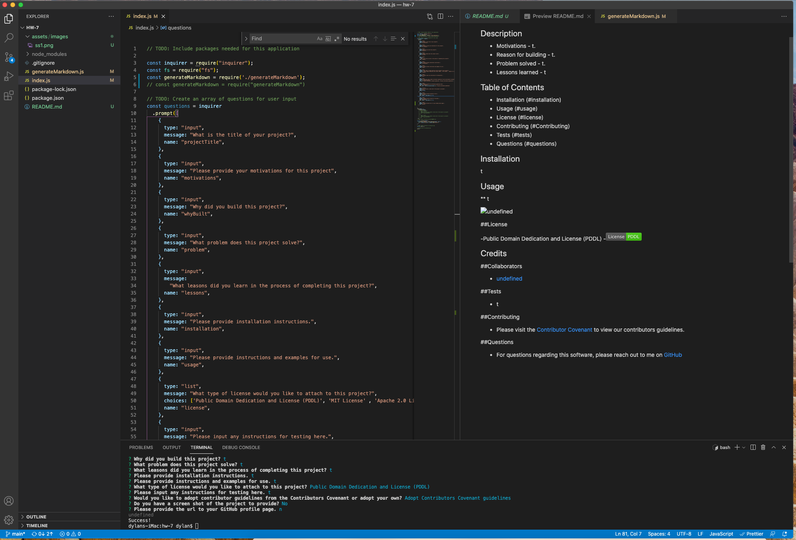

# Read Me Generator
  
## Description
  
  * Motivations - To build a robust and helpful read me generator to steamline the process of building them in the future..
  * Reason for building - Because I ultimately wanted to make my own life easier and learn something new.
  * Problem solved - I now will be able to make a read me file more easily .
  * Lessons learned - I learned a lot about communication back and forth between files and about inquirer
  
## Table of Contents
  
 - [Installation](#installation)
 - [Usage](#usage)
 - [License](#license)
 - [Contributing](#Contributing)
 - [Tests](#tests)
 - [Questions](#questions)

## Installation

none needed

## Usage

 * none needed. would like to have this as a library some day though
  
  
  
  
## License
    
 -
 -

## Contributing
  
 * Please visit the [Contributor Covenant](https://www.contributor-covenant.org/) to view our contributors guidelines.

## Tests

 * none needed

## Questions

 * For questions regarding this software, please reach out to me on [GitHub](https://github.com/dhoneyman)

## Collaborators

- [undefined](undefined)
- [undefined](undefined)

